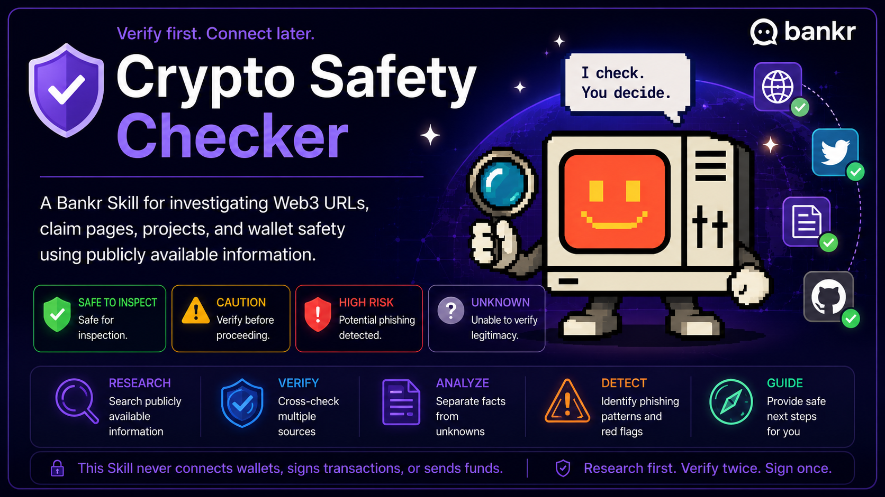

# 🛡 Crypto Safety Checker

A Bankr Skill for investigating Web3 URLs, claim pages, projects, and wallet safety using publicly available information.

> **Verify first. Connect later.**

---

## Why this Skill exists

Many Web3 scams begin with fake websites, fake claim pages, phishing links, or malicious wallet prompts.

Crypto Safety Checker helps users organize publicly available evidence **before** interacting with a website.

Its goal is simple:

- Research first
- Verify facts
- Reduce mistakes

It is **not** designed to replace human judgment or guarantee safety.

---

# ✨ Features

- ✅ Verify official Websites, X, Docs, and GitHub
- ✅ Inspect publicly accessible claim pages
- ✅ Identify common phishing patterns
- ✅ Separate verified facts from unknowns
- ✅ Provide operation-specific guidance
- ✅ Explain why a verdict was reached

---

# 🚀 Example Prompts

- Check this URL.
- Is this website official?
- Verify this claim page.
- Check this contract address.
- Is it safe to connect my wallet?
- Is this project legitimate?

---

# 📊 Example Output

### Verdict

**SAFE TO INSPECT**

### Verified Facts

- Official Website confirmed
- Official X account confirmed
- GitHub repository confirmed

### Risk Factors

- No immediate phishing indicators detected

### Unknowns

- Smart contract code not analyzed
- Wallet signature contents not verified

### Recommended Action

| Action | Recommendation |
|---------|----------------|
| View Website | ✅ SAFE TO INSPECT |
| Connect Wallet | ⚠️ CAUTION |
| Sign Transaction | ⛔ DO NOT PROCEED until verified |
| Approve / Permit | ⛔ DO NOT PROCEED until verified |
| Send Funds | ⛔ DO NOT PROCEED until verified |

---

# 🛡 Risk Levels

## 🟢 SAFE TO INSPECT

Official sources match.

Browsing appears safe.

**This does NOT mean wallet interactions are safe.**

---

## 🟡 CAUTION

Official candidates exist, but additional verification is required before interacting.

---

## 🔴 HIGH RISK

Potential phishing detected.

Examples include:

- Fake domains
- Seed phrase requests
- Suspicious wallet prompts
- Fake contract addresses

---

## ⚪ UNKNOWN

There is insufficient information to verify legitimacy.

Treat with caution until more evidence is available.

---

# 🔍 Investigation Process

This Skill may:

- Search public information
- Compare multiple official sources
- Inspect publicly accessible webpages
- Identify phishing indicators
- Explain verified facts separately from assumptions

---

# ❌ What this Skill does NOT do

This Skill will never:

- Guarantee safety
- Connect wallets
- Sign transactions
- Send funds
- Approve token permissions
- Request seed phrases
- Analyze smart contract bytecode
- Execute blockchain actions

---

# 🤝 Contributions

Bug reports, false positives, false negatives, feature requests, and improvements are welcome.

If you discover incorrect behavior or have ideas to improve the Skill, please open an Issue or Pull Request.

Together we can make Web3 a little safer.

---

# 📄 License

Released under the MIT License.

See the LICENSE file for details.

---

# ⚠️ Disclaimer

Crypto Safety Checker is a research assistant.

It never guarantees safety.

Web3 threats evolve rapidly.

Always review wallet signatures, approvals, transaction details, and destination addresses before confirming any blockchain interaction.

Your safety ultimately depends on your own verification.